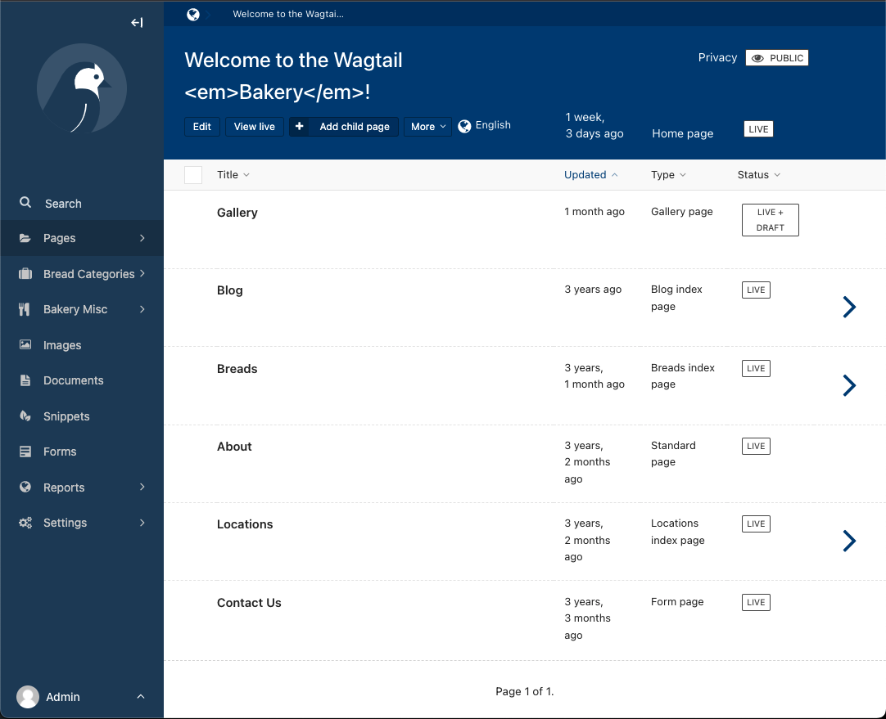

# Workaround for Wagtail issue [#8424](https://github.com/wagtail/wagtail/issues/8424) in Wagtail 3.0

The Wagtail 3.0 admin interface introduces two new indigo shades which are currently not customisable. This can be problematic for Wagtail sites currently [customising Wagtail’s primary color](https://docs.wagtail.org/en/stable/advanced_topics/customisation/admin_templates.html#custom-user-interface-colors).

This will be supported in a future release – in the meantime, to make those shades customisable, we can override Wagtail’s built-in CSS files with specially-crafted alternatives which use CSS variables for those new colors.

Demo of the result with blue theme:



## Full color override

The simplest way to change colors is to change them for the whole of the Wagtail admin at once. First download [an archive of this project](https://github.com/thibaudcolas/wagtail_color_overrides/archive/refs/heads/main.zip) and extract it as a `wagtail_color_overrides` folder.

Then, add `wagtail_color_overrides` to your `INSTALLED_APPS`, _before_ `wagtail.admin`:

```py
INSTALLED_APPS = [
    # […]
    # Make sure this appears before `wagtail.admin` to override its stylesheets.
    "wagtail_color_overrides",
    # […]
    # "wagtail.admin",
]
```

This app contains three `core.css`, `layouts/page-editor.css`, `layouts/home.css` stylesheets which are functionally equivalent to the Wagtail 3.0 release’s stylesheets, except for the addition of two new CSS variables, which we can then customise with a new stylesheet loaded with [`insert_global_admin_css`](https://docs.wagtail.org/en/stable/reference/hooks.html#insert-global-admin-css) in a `wagtail_hooks.py` file:

```py
from django.utils.html import format_html
from django.templatetags.static import static

from wagtail import hooks

@hooks.register('insert_global_admin_css')
def color_overrides():
    return format_html('<link rel="stylesheet" href="{}">', static('css/admin-overrides.css'))
```

Here is a sample stylesheet, where we use the same dark blue hue to replace Wagtail’s primary teal color and the new indigo and indigo accent.

```css
:root {
  /* Set a custom value for officially-supported teal color customisation. */
  /* See https://docs.wagtail.org/en/stable/advanced_topics/customisation/admin_templates.html#custom-user-interface-colors. */
  --color-primary-hue: 210;
  /* Set custom values for Wagtail 3.0 indigo shades */
  /* See https://github.com/wagtail/wagtail/issues/8424. */
  --custom-admin-indigo: hsl(210 50% 25%);
  --custom-admin-indigo-accent: hsl(210 50% 20%);
}
```

## Partial overrides

It’s also possible to change the new colors in only some of the admin, though this is less reliable, as we’re now changing the stylesheets’ source order. Here are all the CSS declarations using the new colors, with CSS variables added for ease of overriding:

```css
:root {
  /* Set a custom value for officially-supported teal color customisation. */
  /* See https://docs.wagtail.org/en/stable/advanced_topics/customisation/admin_templates.html#custom-user-interface-colors. */
  --color-primary-hue: 210;
  /* Set custom values for Wagtail 3.0 indigo shades */
  /* See https://github.com/wagtail/wagtail/issues/8424. */
  --custom-admin-indigo: hsl(210 50% 25%);
  --custom-admin-indigo-accent: hsl(210 50% 20%);
}

/* home.css color overrides */

.homepage header {
  color: var(--custom-admin-indigo);
}

/* page-editor.css overrides */

.page-editor .form-side__close-button {
  color: var(--custom-admin-indigo);
}
.page-editor .form-side__close-button:hover {
  color: var(--custom-admin-indigo-accent);
}

/* core.css color overrides */

.w-h1 {
  color: var(--custom-admin-indigo);
}
.w-h4,
.w-label-1 {
  color: var(--custom-admin-indigo);
}
.w-label-3 {
  color: var(--custom-admin-indigo);
}
.c-page-explorer__item > :not([hidden]) ~ :not([hidden]) {
  border-color: var(--custom-admin-indigo);
}
.c-page-explorer__item {
  border-color: var(--custom-admin-indigo);
}
.c-page-explorer__item__link:focus,
.c-page-explorer__item__link:hover {
  background-color: var(--custom-admin-indigo);
}
.c-page-explorer__item__action:focus,
.c-page-explorer__item__action:hover {
  background-color: var(--custom-admin-indigo);
}
.c-page-explorer {
  background-color: var(--custom-admin-indigo-accent);
}
.c-page-explorer__header {
  background-color: var(--custom-admin-indigo-accent);
  border-color: var(--custom-admin-indigo);
}
.c-page-explorer__header__title:focus,
.c-page-explorer__header__title:hover {
  background-color: var(--custom-admin-indigo);
}
.c-page-explorer__header__select {
  background-color: var(--custom-admin-indigo);
}
.c-page-explorer__header__select-icon {
  color: var(--custom-admin-indigo);
}
.w-tabs__tab {
  color: var(--custom-admin-indigo);
}
.w-tabs__tab:after {
  background-color: var(--custom-admin-indigo);
}
.w-tabs__tab:hover {
  color: var(--custom-admin-indigo);
}
.w-tabs__tab[aria-selected="true"] {
  color: var(--custom-admin-indigo);
}
.modal .close {
  background-color: var(--custom-admin-indigo-accent);
  border-color: var(--custom-admin-indigo);
}
.modal-body header {
  background-color: var(--custom-admin-indigo);
}
header,
header a {
  color: var(--custom-admin-indigo);
}
header h1,
header h2 {
  color: var(--custom-admin-indigo);
}
header .search-form .icon {
  color: var(--custom-admin-indigo);
}
.sidebar,
.sidebar-loading {
  background-color: var(--custom-admin-indigo);
}
.sidebar-loading__inner,
.sidebar__inner {
  background-color: var(--custom-admin-indigo);
}
.sidebar-nav-toggle--mobile {
  background-color: var(--custom-admin-indigo);
}
.sidebar-nav-toggle--mobile:hover {
  background-color: var(--custom-admin-indigo-accent);
}
.sidebar-nav-toggle--open:hover {
  background-color: var(--custom-admin-indigo-accent);
}
.sidebar-menu-item--active {
  background-color: var(--custom-admin-indigo-accent);
}
.sidebar-sub-menu-panel {
  background-color: var(--custom-admin-indigo-accent);
}
.sidebar-footer {
  background-color: var(--custom-admin-indigo);
}
.tippy-box {
  background-color: var(--custom-admin-indigo);
}
.tippy-box[data-placement^="top"] > .tippy-arrow:before {
  border-top-color: var(--custom-admin-indigo);
}
.tippy-box[data-placement^="bottom"] > .tippy-arrow:before {
  border-bottom-color: var(--custom-admin-indigo);
}
.tippy-box[data-placement^="left"] > .tippy-arrow:before {
  border-inline-start-color: var(--custom-admin-indigo);
}
.tippy-box[data-placement^="right"] > .tippy-arrow:before {
  border-inline-end-color: var(--custom-admin-indigo);
}
.w-bg-primary {
  background-color: var(--custom-admin-indigo);
}
.w-bg-primary-200 {
  background-color: var(--custom-admin-indigo-accent);
}
.w-text-primary {
  color: var(--custom-admin-indigo);
}
.w-text-primary-200 {
  color: var(--custom-admin-indigo-accent);
}
.hover\:w-bg-primary-200:hover {
  background-color: var(--custom-admin-indigo-accent);
}
.hover\:w-text-primary:hover {
  color: var(--custom-admin-indigo);
}
.hover\:w-border-primary:hover {
  border-color: var(--custom-admin-indigo);
}
.focus\:w-bg-primary-200:focus {
  background-color: var(--custom-admin-indigo-accent);
}
.focus\:w-text-primary:focus {
  color: var(--custom-admin-indigo);
}
```
